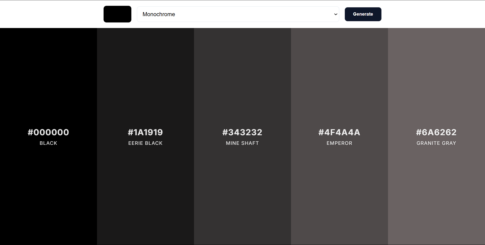
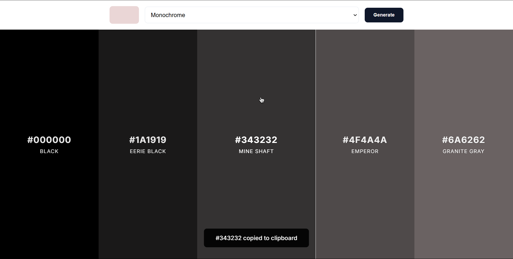
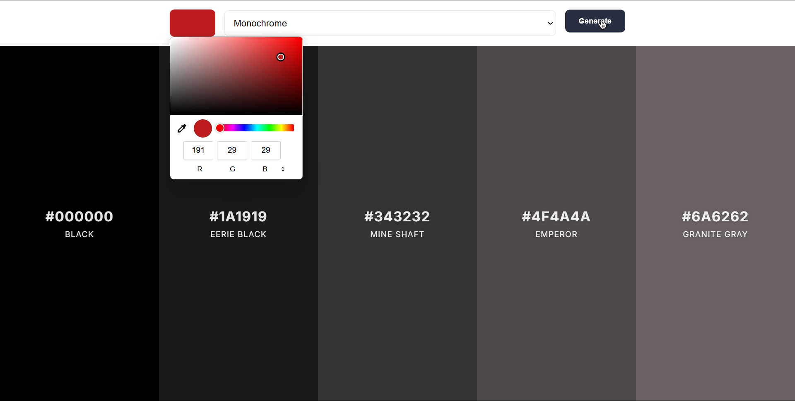
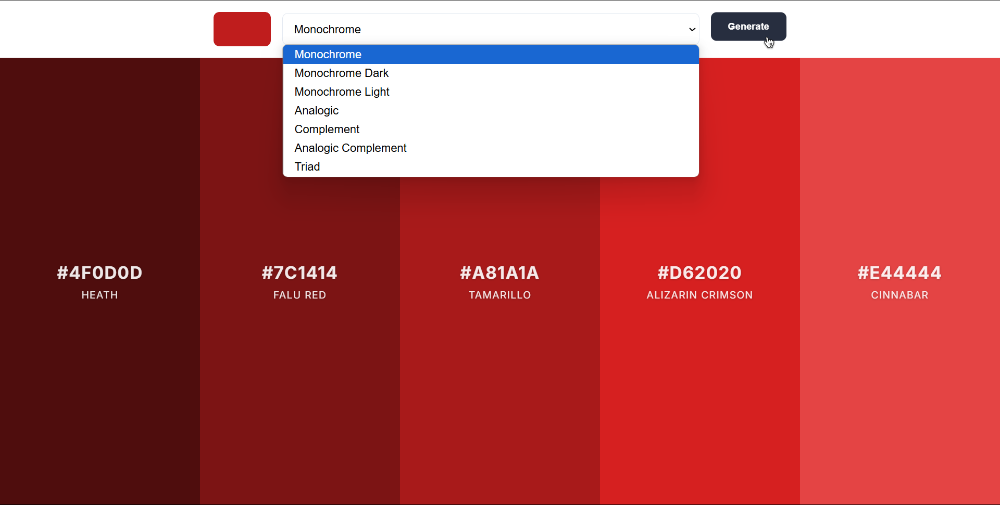
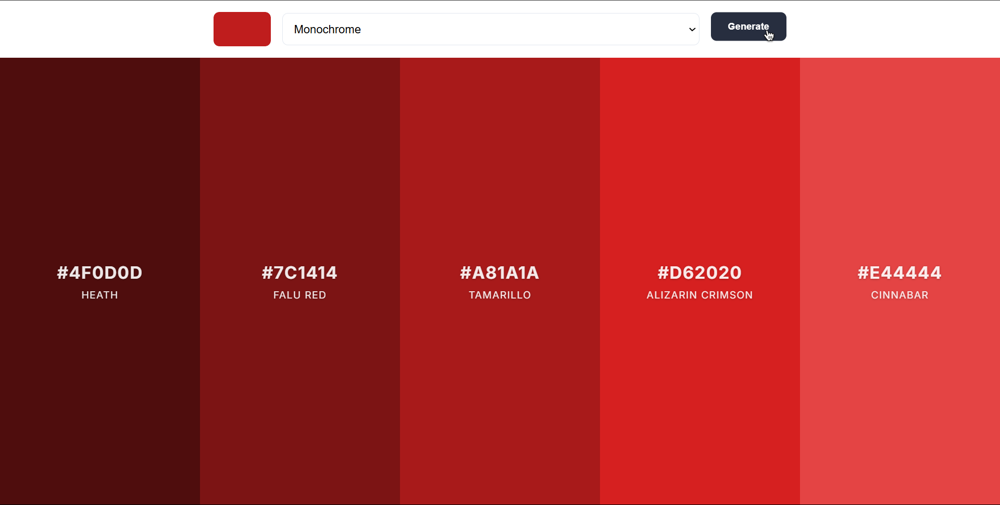

# Color Scheme Generator

<div align="center">


A sophisticated color scheme generator that creates beautiful, harmonious color palettes based on user selection. Powered by the [Color API](https://www.thecolorapi.com/), it offers various color harmony options and instant color code copying for seamless integration into your projects.

[Features](#-features) • [Tech Stack](#-tech-stack) • [Installation](#-installation--setup) • [Screenshots](#-screenshots) • [Live](#-live) • [Contributing](#-contributing)

</div>

## Features
- **Interactive Color Selection** - Choose your base color using an intuitive color picker
- **Multiple Harmony Options** - Generate schemes in various modes:
  - Monochrome
  - Monochrome Dark
  - Monochrome Light
  - Analogic
  - Complement
  - Analogic Complement
  - Triad
- **One-Click Copy** - Instantly copy color codes with a simple click
- **Real-time Preview** - See your color scheme update instantly
- **Responsive Design** - Works seamlessly on all devices
- **Modern Interface** - Clean, intuitive design with smooth animations

## Tech Stack

### Frontend
- **HTML5** - Semantic structure
- **CSS3** - Modern styling with animations
- **JavaScript** - Dynamic color manipulation

### API
- **[The Color API](https://www.thecolorapi.com/)** - Color scheme generation

## Installation & Setup

1. **Clone the repository**

   ```bash
   git clone https://github.com/your-username/color-scheme-generator.git
   cd color-scheme-generator
   ```

2. **Launch the Project**

3. **Open `index.html` in your preferred browser**

4. **No additional dependencies or setup required**

## Screenshots

<div align="center">

### Landing Page


### Selecting a Shade


### Color Select


### Mode Select


### Generated Results


</div>

## Live

<div align="center">

[](https://palette.ashwin.co.in)

</div>

## Contributing
Contributions are welcome! Here's how you can help improve the Color Scheme Generator:

1. Fork the repository
2. Create a feature branch:

   ```bash
   git checkout -b feature/amazing-feature
   ```

3. Commit your changes:

   ```bash
   git commit -m 'Add some amazing feature'
   ```

4. Push to the branch:

   ```bash
   git push origin feature/amazing-feature
   ```

5. Open a Pull Request

## Future Enhancements
- Save favorite color schemes
- Export palettes in different formats (CSS, SCSS, JSON)
- Custom color harmony rules
- Color accessibility checking
- Palette sharing functionality

---

<div align="center">
Made with ❤️ by Ashwin S Nambiar
</div>
